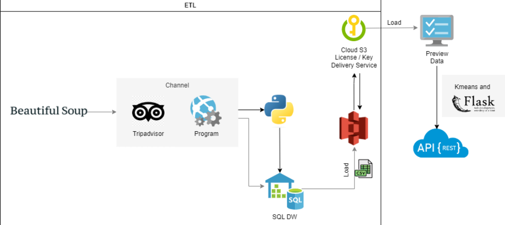
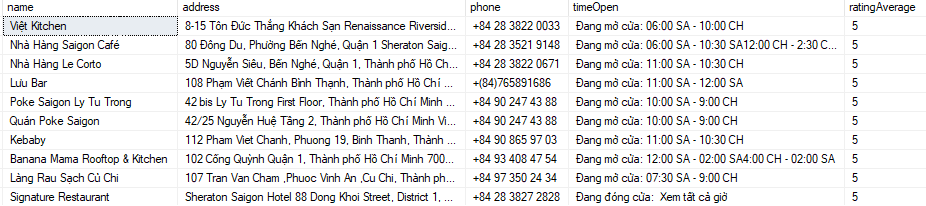
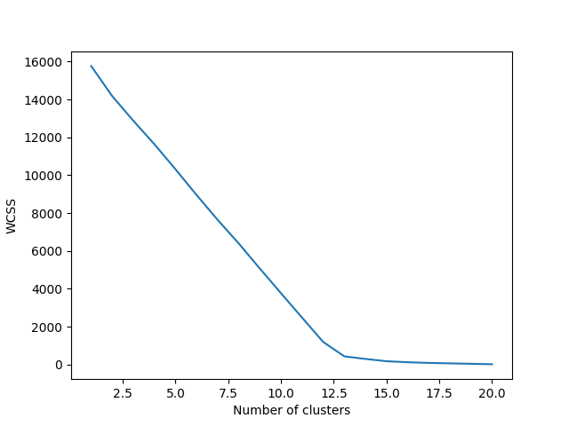
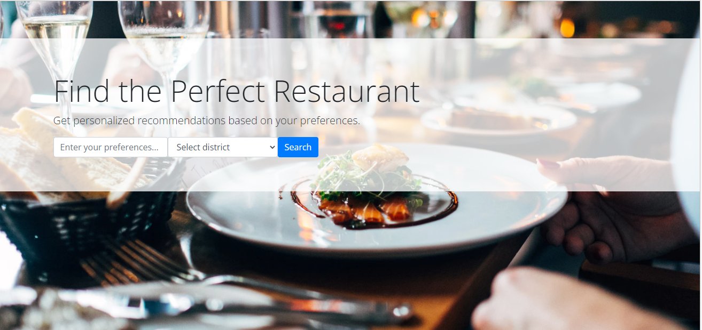
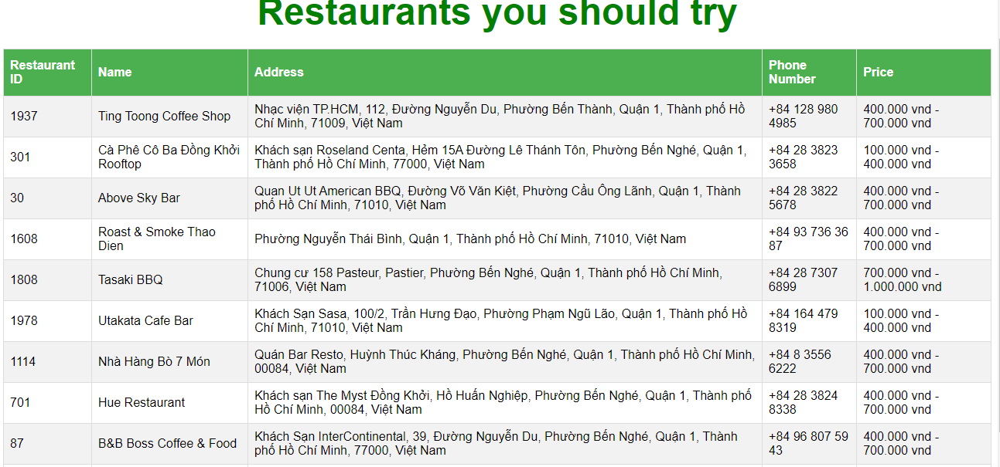

# TRIPADVISOR RECOMMENDATION

[Website](https://www.tripadvisor.com.vn/)
```
print('Hi there! This is my first personal mini project')
```
## Main workflow



###My responsibilities

  ***Crawling data***
  Using BeautifulSoup to extract hyperlinks pages to extract all links each restaurants, after that, extracting all informations of each restaurants in Ho Chi Minh (name, address, phone, rating average, open time, details).


  ***Preprocessing data***

  **General columns**
  + Remove duplicate restaurant (same restaurants with same address)
  + Remove null restaurant that does not have name and address.
  
  **Detail column**
  + Fill the null value 
  + Filter the numeric values in this details column.

  **PriceRange column**
  + Get the id for each restaurant ( unique value)
  + Remove the special character
  + Split minimum and maximum price to make it easy for manage price
  **NOTE**: In this case, value of minimum and maximum price still be as string value
  + With outlier like: bilion value => remove some digits into reasonable values
  + Handle the length of them to make it worth (too small, too large or the gap  between minimum and maximum is so far)
  + Fill the null price base on type of details (type of foods like vietnam, euro, US,...)
  + Build a list of range price.
  
  **Rating column**
  + With null records, refer to their details and observe types of them obviously, counting the average rating of all restaurants with similar types, then, adding those values into null values.
  + Convert data type to float
  + **Export data into file csv.**
  + **Continue to process data using Python: standardlizing location of restaurants**
  
  ***Connecting to the cloud for storing (AWS S3)***
  + As root user, using access key and buckets to store data as csv file.
  
  ***Building K-Means model***
  + Re-preprocess data (basically)
  + Implementing TF-IDF method to extract features of texts (detail column)
  + Selecting k: after putting it to K elbow and visualize it, i absolutely choose K = 12 (the number of clusters is 12)
  

  ***Generating a basic web application (Rest-API)***
  + Finally, after building Kmeans model, I deploy it to Rest-API to present model obviously.






  


